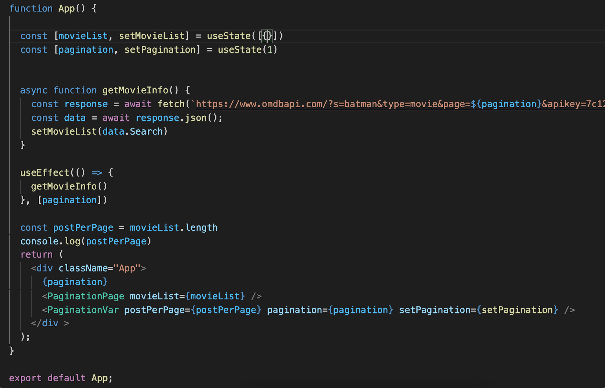
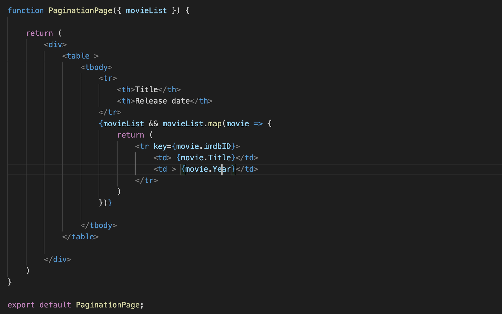
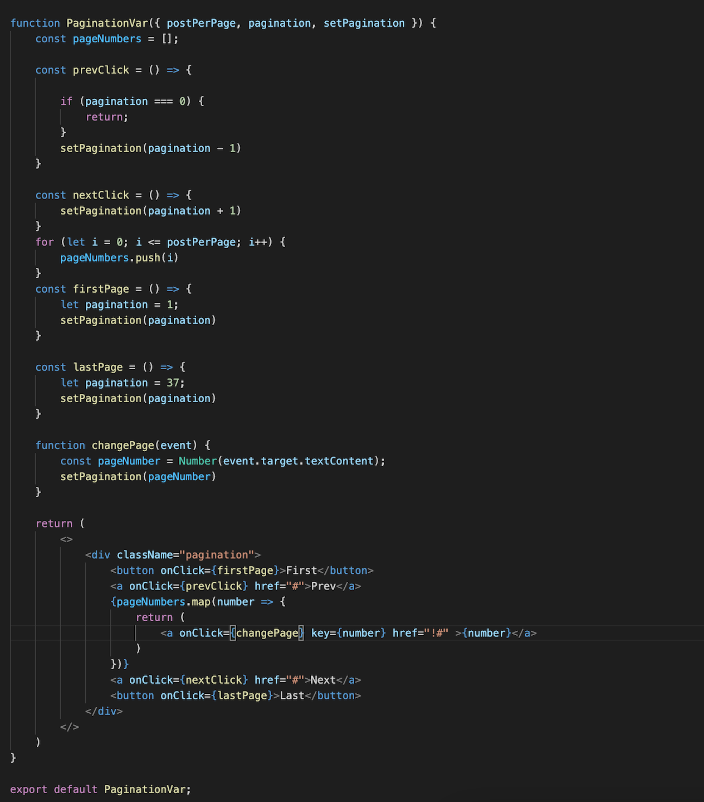

# The Pagination Page

This project was bootstrapped with [Create React App](https://github.com/facebook/create-react-app).

## Available Scripts

In the project directory, you can run:

### `npm start`

Runs the app in the development mode.\
Open [http://localhost:3000](http://localhost:3000) to view it in the browser.

The page will reload if you make edits.\
You will also see any lint errors in the console.

### `A guide to build a pagination component in react`

# What it is?
When fetching data(you have to know the size of the data already to use pagination and don’t add or delete data) from an API and render it in the screen we use pagination.

Rendering all the data at once makes your computer really slow, to optimize the performance we use pagination.

# The Pagination Component.

After having already our react-app we are going to create a pagination component.
There we will use the following:

-A **PaginationVar** and a **PaginationPage** component.

### `App.js (the parent of everything):`

The prop we will declare in our parent.

-pagination: the page we are in(initial value is 1 and this is an array)
We will useState to change the value and we will incorporate it to the API url value to make it dynamic.
The state is pagination and the function is setPagination.

-movieList: the array of objects that we are going to fetch and render.
Function setMovieList.

-postPerPage: the length of the movieList that is going to be always 10 by default.

-Index: the index for our current value(state component)
-pageSize:represents the amount of data rendered in every page.(constant)
-onPageChange:callback function that runs when the page is updated.

### PaginationPage:
- I created it to display the table of the list of movies rendered in every page.
- We use movieList and fetch the data we want.

### PaginationVar:

-It will use postPerPage, pagination and setPagination props from the parent.
We will proceed to create the function prevClick and nextClick for the next and prev buttons.
-We will also add the functionality to the numbers of the pages to go to that page depending on the number from 1 to 10.
-And the first and last page buttons that will redirect the user to the last and first page.
 

Our core skeleton:



The PaginationPage component:


The PaginationVar component:



 
